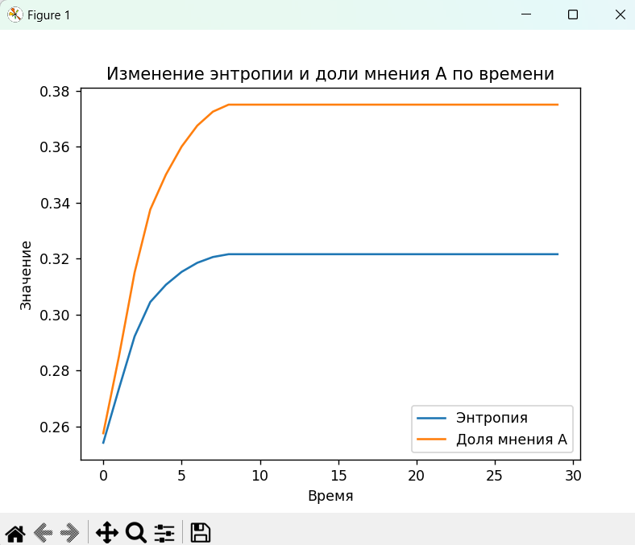

# Агентная модель "Учет мнений"

## Функционал

- Представляет собой модификацию игры "Жизнь" Джона Конвея https://ru.wikipedia.org/wiki/Игра_«Жизнь». 
- Типы Агентов: конформист, нонконформист, упрямый
- Типы поиска соседей: 4-крест, 8-обод, случайный.

## Запуск

Клонируйте репозиторий через среду разработки, либо скачайте архив проекта: зеленая кнопка "Code" -> "Download ZIP"
Для установки зависимостей выполните в Терминале:

```sh
pip install -r requirements.txt
```
## Использование

### Конфигурирование

В папке `configs`находятся конфигурационные файлы стартовых полей. Их структура следующая:

```json
{
    "iterations": 20,
    "field_type": "Rim",
    "field_size": 20,
    "field": "[[0, 1, ...,  0], ..., [1, 1, ..., 0]]",
    "opinions": "[[0, 2, ...,  0], ..., [1, 2, ..., 0]]"
}
```
`iterations` - количество итераций
`field-type` - тип поиска соседей для всех Агентов ('Rim' | 'Cross' | 'Full')
`field_size` - размер поля
`field` - матрица изначальных мнений
`opinions` - матрица типов Агентов (конформисты | нонконформисты | упрямые)

### Запуск

Запуск программы происходит в `main.py`
В консоли будет предложено выбрать номер одного из конфигурационных файлов для старта программы.

### Результат
После выполнения программмы будет создана директория `opinion_maps` с картинками, отображающими состояние поля на каждой итерации. Также будут выведен график изменения доли мнений и энтропии. 


[//]: # (These are reference links used in the body of this note and get stripped out when the markdown processor does its job. There is no need to format nicely because it shouldn't be seen. Thanks SO - http://stackoverflow.com/questions/4823468/store-comments-in-markdown-syntax)

   [dill]: <https://github.com/joemccann/dillinger>
   [git-repo-url]: <https://github.com/joemccann/dillinger.git>
   [john gruber]: <http://daringfireball.net>
   [df1]: <http://daringfireball.net/projects/markdown/>
   [markdown-it]: <https://github.com/markdown-it/markdown-it>
   [Ace Editor]: <http://ace.ajax.org>
   [node.js]: <http://nodejs.org>
   [Twitter Bootstrap]: <http://twitter.github.com/bootstrap/>
   [jQuery]: <http://jquery.com>
   [@tjholowaychuk]: <http://twitter.com/tjholowaychuk>
   [express]: <http://expressjs.com>
   [AngularJS]: <http://angularjs.org>
   [Gulp]: <http://gulpjs.com>

   [PlDb]: <https://github.com/joemccann/dillinger/tree/master/plugins/dropbox/README.md>
   [PlGh]: <https://github.com/joemccann/dillinger/tree/master/plugins/github/README.md>
   [PlGd]: <https://github.com/joemccann/dillinger/tree/master/plugins/googledrive/README.md>
   [PlOd]: <https://github.com/joemccann/dillinger/tree/master/plugins/onedrive/README.md>
   [PlMe]: <https://github.com/joemccann/dillinger/tree/master/plugins/medium/README.md>
   [PlGa]: <https://github.com/RahulHP/dillinger/blob/master/plugins/googleanalytics/README.md>
